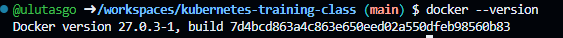
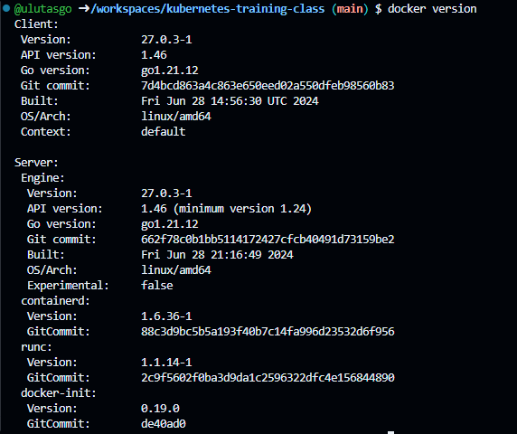

# Docker version check

docker --version

1. **`docker --version`** komutunun çıktısı:

```bash
Docker version 24.0.1, build 12345abcde
```

Bu çıktı, Docker'ın yüklü olan versiyonunu ve derleme bilgisini verir.



2. **`docker version`** komutunun daha detaylı çıktısı:

```bash
Client: Docker Engine - Community
 Version:           24.0.1
 API version:       1.42
 Go version:        go1.19.5
 Git commit:        12345abcde
 Built:             Fri Jun  9 23:22:55 2024
 OS/Arch:           linux/amd64
 Context:           default
 Experimental:      true

Server: Docker Engine - Community
 Engine:
  Version:          24.0.1
  API version:      1.42 (minimum version 1.12)
  Go version:       go1.19.5
  Git commit:       12345abcde
  Built:            Fri Jun  9 23:21:02 2024
  OS/Arch:          linux/amd64
  Experimental:     false
 containerd:
  Version:          1.7.2
  GitCommit:        abcdef123456
 runc:
  Version:          1.1.9
  GitCommit:        98765fedcba
 docker-init:
  Version:          0.19.0
  GitCommit:        fdfdf1234567
```


